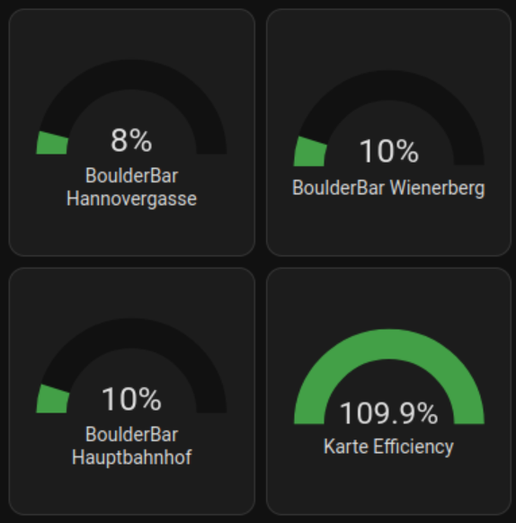

# Get information about austrian boulderbar climbing gym capacity 

A sensor platform which allows you to get information about your favourite boulderbar climbing gym capacity


## Example configuration.yaml

```yaml

boulderbar:
  locations:
    - Hauptbahnhof
    - Hannovergasse
    - Wienerberg


```

## Configuration variables

key | description
-- | --
**platform (Required)** | The platform name
**location (Required)** | The gym name

## dashboard exemple card.yaml


```yaml
type: grid
cards:
  - type: heading
    heading_style: title
    heading: Climbing
  - type: gauge
    entity: sensor.boulderbar_hannovergasse
    severity:
      green: 0
      yellow: 45
      red: 70
    grid_options:
      columns: 6
      rows: 3
  - type: gauge
    entity: sensor.boulderbar_wienerberg
    severity:
      green: 0
      yellow: 45
      red: 70
    grid_options:
      columns: 6
      rows: 3
  - type: gauge
    entity: sensor.boulderbar_hauptbahnhof
    severity:
      green: 0
      yellow: 45
      red: 70
    grid_options:
      columns: 6
      rows: 3

```

## Overview




## Notes


ROOMS_MAPPING = {
    "260": "Linz",
    "261": "Salzburg",
    "262": "Hannovergasse",
    "263": "Hauptbahnhof",
    "264": "Seestadt",
    "265": "Wienerberg",
    "284": "St_Poelten"
}

This platform is using the [Boulderbar API](http://www.boulderbar.net) API to get the information.


